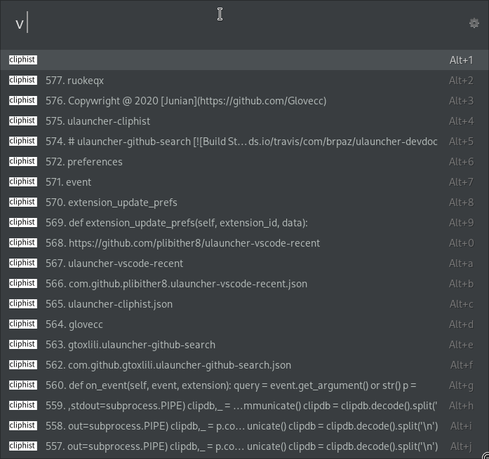

# ulauncher-github-search

[](https://github.com/brpaz/ulauncher-devdocs/blob/master/LICENSE)

> [Ulauncher](https://ulauncher.io) extension to search repository on Github

## What is this

integrate the [cliphist](https://github.com/sentriz/cliphist) in ulauncher

## Demo



## Requirements

```
go install go.senan.xyz/cliphist@latest
```

```
pip install -r https://raw.githubusercontent.com/ruokeqx/ulauncher-cliphist/master/requirements.txt
```

## Install

Open ulauncher preferences window -> extensions -> add extension and paste the following url:

```
https://github.com/ruokeqx/ulauncher-cliphist
```

## License 

Copywright @ 2023 [ruokeqx](https://github.com/ruokeqx)